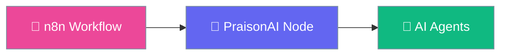

# n8n PraisonAI Node

Run PraisonAI agents in n8n workflows.

## Quick Start

1. **Install** in n8n
2. **Add** PraisonAI node
3. **Configure** API credentials
4. **Run!** 🚀

## Features

| Feature | Description |
|---------|-------------|
| 🤖 AI Agents | Run PraisonAI agents |
| 🔗 Workflow | n8n integration |
| ⚡ Async | Async execution support |

## Next Steps

- [Installation](getting-started/installation.md)
- [Usage](getting-started/usage.md)
